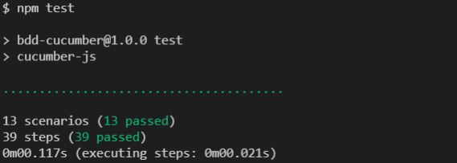

# BDD Cucumber
Este es un ejemplo de una Calculadora básica empleando [BDD](https://en.wikipedia.org/wiki/Behavior-driven_development) con [Cucumber](https://cucumber.io/docs/cucumber).

## Prerequisitos

* [Node.js](http://nodejs.org?target=_blank)
* [NPM](http://npmjs.org?target=_blank)
* [cucumber-js](https://github.com/cucumber/cucumber-js?target=_blank)

## Instalación

* Clonar este repositorio con `git clone`
* Ingresar al directorio con `cd bdd-cucumber`
* Instale todas las dependencias necesarias con `npm install`

## Uso

* Ejecute BDD Cucumber `npm test`

Debería ver algo como esto para saber que NPM instaló @cucumber/cucumber correctamente y que las pruebas pueden ejecutarse.

>

>El **reporte publicado** de la ejecución se encuentra disponible en [https://reports.cucumber.io/reports/276a66a9-c2a3-4f5f-826b-bda62775d947](https://reports.cucumber.io/reports/276a66a9-c2a3-4f5f-826b-bda62775d947?target=_blank)

>**El video de la ejecución de la prueba es: [Video BDD Cucumber](./images/bdd-cucumber.pm4)**

## Licencia
MIT
