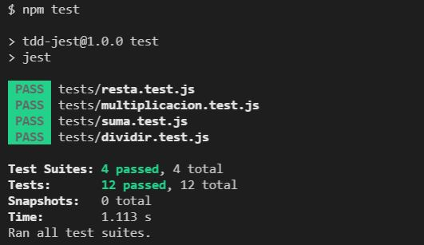

# BDD Cucumber
Este es un ejemplo de una Calculadora básica empleando [TDD]https://en.wikipedia.org/wiki/Test-driven_development) con [Jest](https://jestjs.io/docs/getting-started).

## Prerequisitos

* [Node.js](http://nodejs.org?target=_blank)
* [NPM](http://npmjs.org?target=_blank)
* [jest-js](https://github.com/facebook/jest?target=_blank)

## Instalación

* Clonar este repositorio con `git clone`
* Ingresar al directorio con `cd tdd-jest`
* Instale todas las dependencias necesarias con `npm install`

## Uso

* Finalmente ejecute BDD Cucumber `npm test`

Debería ver algo como esto para saber que NPM instaló jest correctamente y que las pruebas pueden ejecutarse.

>

>**El video de la ejecución de la prueba es: [Video TDD Jest](./images/tdd-jest.pm4)**

## Licencia
MIT
